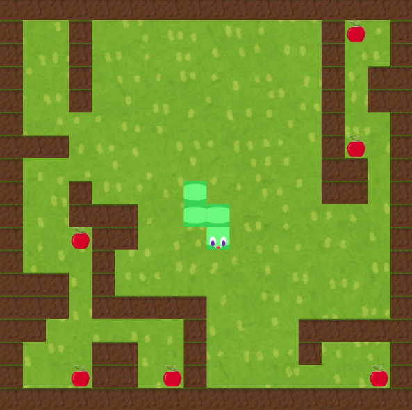
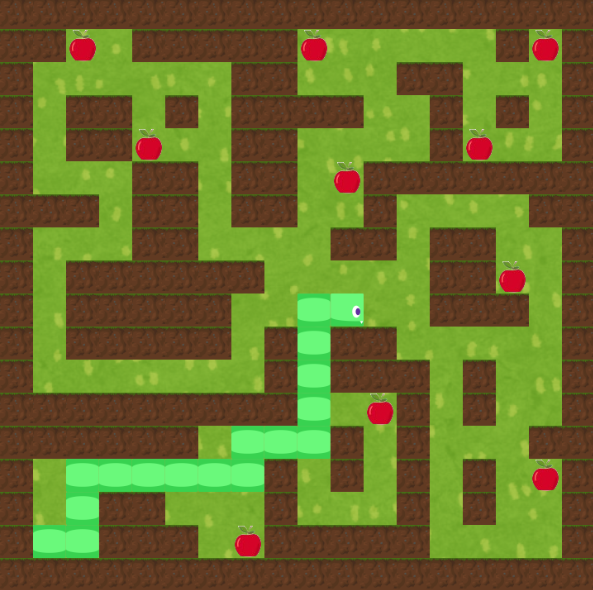
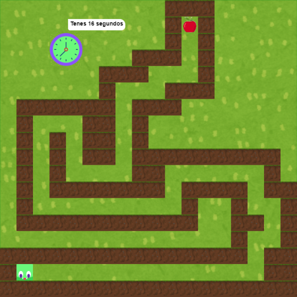

#  Minijuegos

UTN - Facultad Regional Buenos Aires - Materia Paradigmas de Programación

## Ideas iniciales:
El juego consta de 3 minijuegos principales diseñados para que compartan metodos en común para que sea clara la aplicación de polimorfismo y los conceptos principales vistos durante la cursada.
El objetivo de cada nivel es agarrar todas las manzanas que esten en el mapa, al hacerlo pasara automaticamente al siguiente nivel.

### Nivel 1:
Es un puzzle en el cual al comer una manzana la serpiente crece, las manzanas estan colocadas en forma estrategica para que sea dificil conseguirlas todas, ya que si la cabeza choca con el cuerpo se reinicia el nivel. 

### Nivel 2:
Similar al anterior con la diferencia de que cada vez que nos movamos el cuerpo crecera dejando un rastro que reducira nuestra movilidad en el laberinto.

### Nivel 3:
Este nivel tiene una dinamica distinta, el cuerpo ya no crece, el personaje tiene que recorrer el laberinto y agarrar la manzana al final en 20 segundos, si el reloj llega a cero o toca las paredes se reiniciara el nivel(junto con el reloj).

## Equipo de desarrollo: 

- Azul Martin Petrocelli
- Federico Migliavacca
- Franco Juan Ramos
- Lautaro Dario Cicala Fontao
- Santiago Gutman

## Explicación teorica

Durante la creación del juego, aplicamos diversos conceptos fundamentales vistos en la cursada con el objetivo de proporcionar mayor declaratividad y expresividad al trabajo. Al diseñar los tres juegos, nos encontramos con una serie de similitudes entre ellos, como el crecimiento del cuerpo del personaje, la acumulación de puntos, y la aparición y desplazamiento del personaje a través del entorno. Estas similitudes nos llevaron a la decisión de implementar una clase general llamada Partida y una clase Personaje, a partir de las cuales generamos instancias específicas para cada uno de los juegos. Este enfoque nos permitió manejar de manera más eficiente los aspectos comunes y evitar redundancias en el código.

Adicionalmente, descubrimos que elementos como las paredes y las manzanas compartían características y comportamientos similares, tales como su aparición en ciertas ubicaciones y su desaparición una vez cumplidas determinadas condiciones del juego. Para abordar esta repetición, decidimos crear una clase base llamada Cosas, de la cual heredaron las clases específicas de cada tipo de objeto en el juego, incluyendo las dos variantes de paredes y las manzanas. Esta implementación de la herencia no solo nos permitió agrupar comportamientos comunes, sino que también facilitó la reutilización de métodos y la extensión de nuevas funcionalidades sin complicar la estructura original del código, manteniéndolo más limpio y organizado.

En lo que respecta al movimiento del personaje, implementamos una clase Movimiento, cuyo propósito es almacenar las posiciones actuales y futuras del personaje y gestionar su desplazamiento por el escenario. Esta clase incluye un método moverse que evalúa si la siguiente posición es válida o si existe una pared en la dirección elegida para el movimiento. Dependiendo de la dirección seleccionada, el método es enviado al objeto correspondiente que hereda los atributos y métodos de Movimiento, lo que permite adaptar el comportamiento a las variaciones específicas de cada tipo de movimiento sin necesidad de duplicar código.

Para manejar la configuración global del juego, decidimos implementar un objeto Configuración, el cual se encarga de centralizar la lógica y las propiedades generales que no pertenecen a un juego en particular, como la selección de la partida en curso y las configuraciones de los visuales comunes entre los juegos. Este enfoque centralizado permite simplificar y organizar mejor el código.

El uso de herencia y la estructuración en clases, junto con la implementación del objeto Configuración, no solo evita la repetición de código, sino que también incrementa el polimorfismo del diseño. Los objetos creados a partir de las clases base y las clases heredadas comparten métodos comunes, lo que otorga al código una mayor flexibilidad y facilita su adaptación a futuras modificaciones o ampliaciones. Gracias a este enfoque, el código no solo es más limpio y estructurado, sino que también resulta más fácil de entender, de mantener y de expandir, lo que en última instancia mejora la claridad del proyecto y facilita la implementación de nuevas características o la corrección de errores.
